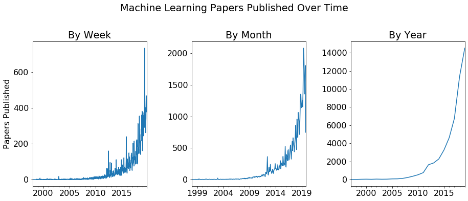

# Steven Rouk - The Evolution of Machine Learning

_Analysis of the evolution of the field of machine learning as discovered through natural language processing (NLP) techniques applied to research papers on [arXiv.org](https://arxiv.org/)._

---

**You can find me on LinkedIn here: [Steven Rouk - LinkedIn](https://www.linkedin.com/in/stevenrouk/)**

---

## Table of Contents
1. [Motivation](#motivation)
2. [The Data](#the-data)
3. [Exploratory Data Analysis (EDA)](#exploratory-data-analysis-eda)
4. [Topic Modeling](#topic-modeling)
5. [Other Interesting Findings](#other-interesting-findings)
6. [Conclusion](#conclusion)
7. [Future Research](#future-research)
8. [Appendix #1: Technologies & Techniques Used](#appendix-1-technologies--techniques-used)
8. [Appendix #2: Project Organization](#appendix-2-project-organization)

## Motivation

### A Brief History

It's no overstatement to say that machine learning—and data science more broadly—is revolutionizing our society.

Just for a bit of perspective:

- The first web browser was made available to the public in 1991.
- Deep Blue (by IBM) beat Garry Kasparov in chess in 1997.
- Google was founded in 1998.
- The first iPhone was released in 2007.
- Watson (once again by IBM) beat Jeopardy champions Brad Rutter and Ken Jennings in 2011.
- AlphaGo (by Google/DeepMind) beat a 9-dan professional Go player in 2016.
- The first self-driving car completed the first DARPA Grand Challenge in 2005. By the end of 2016, Google's fleet of self-driving cars had completed over 2,000,000 autonomous miles.
- In 2018, an NLP AI by Alibaba outperformed Stanford students on a reading and comprehension test, and Google releases "Duplex", an AI assistant with an incredibly human-like voice that can make reservations for you.

And keep in mind that thirty years ago, most homes in the US didn't have a personal computer. Ten years ago, most people in the US weren't using smartphones. These days, the computing power available to the average person is astronomically more than was available in previous years, which is democratizing access to the computing power needed to accomplish incredible technological feats using data. As one article puts it, thanks to Moore's Law ["Your smartphone is millions of times more powerful than all of NASA’s combined computing in 1969"](https://www.zmescience.com/research/technology/smartphone-power-compared-to-apollo-432/).

Whereas previously you needed supercomputers and teams of researchers to create algorithms even capable of recognizing hand-written digits, these days millions of people have the computing power needed to create sophisticated facial recognition algorithms. (And for those who don't posess the computing power on their personal machines, they can simply purchase it through platforms like [AWS](https://aws.amazon.com/machine-learning/).) And according to Google search volume, people are taking notice.

<b></b> [Google Trends](https://trends.google.com/trends/explore?date=all&geo=US&q=%2Fm%2F01hyh_) - Machine Learning Search Volume 

### A Rapidly Evolving Field

With this kind of quickly changing technological landscape, I was curious as to characteristics of machine learning and how those have changed over the last few decades. As a data scientist and machine learning practitioner, I'm constantly looking for ways to better understand the field and keep up with developments. If I could find a way to analyze the recent trajectory of machine learning, I would be in a better place from which to put it to good use.

## The Data

To get a sense of the evolution of machine learning, I turned to the research paper hosting website [arXiv.org](https://arxiv.org/) (which is a service of Cornell University), a site which bills itself as "Open access to 1,605,550 e-prints in the fields of physics, mathematics, computer science, quantitative biology, quantitative finance, statistics, electrical engineering and systems science, and economics." (Note: Thanks to [github.com/niderhoff/nlp-datasets](https://github.com/niderhoff/nlp-datasets) for pointing me in the right direction when I was looking for datasets.)

<b></b> arXiv.org 

ArXiv graciously makes the metadata for their whole collection of research papers available through an open API, which meant that I could download descriptions for all 1.6 million papers. For a single API call, the metadata was returned as an XML object with 1000 records, where each record looked like this:

<b></b> Research Paper XML Record 

### Pulling the Data

The first task was to pull all of the metadata and store it locally for analysis. A quick back-of-the-napkin calculation told me I should expect the full data pull to run about 3 GB in size, so I chose to store each response as a raw XML text file initially for later processing and analysis. In total, I made over 1,600 API calls over the course of 24 hours to pull all of the data.

### Processing the Data

While the full dataset was downloading, I wrote scripts to process the XML data into a series of structured CSV files with just the information I wanted: id, url, title, set, subjects, authors, date, and description. I ended up primarily using title, set, subjects, date, and description in my analysis, although I would like to conduct further analysis using authors.

After processing the XML files to individual CSVs, I used another script to combine all of these CSVs into a single CSV that could be directly loaded as a pandas DataFrame. I created another CSV file with just research papers that had the phrase "machine learning" in one of their subjects.

The final processed CSV file ended up being 1.7 GB, and the machine learning subset CSV file ended up as 81 MB. (This was down from a raw data size of 3.1 GB.)

## Exploratory Data Analysis (EDA)

First, I looked at the general distribution of papers by subject on arXiv.

<b></b> arXiv Papers by Subject 

As you can see, the majority of the papers published on arXiv are physics papers—although according to their own analysis, this might be changing with the rise of machine learning. (See https://arxiv.org/help/stats/2018_by_area/index for more.)

What I was really interested in was the research papers specifically related to machine learning. I filtered the data down to just these papers by finding all papers that had "machine learning" as part of one of the subjects listed. There were 48,564 such papers, which accounted for about 3% of the total number of papers pulled from the site. The distribution of the subjects listed for these papers is shown below.

<b></b> Machine Learning Paper Subjects 

Although the two subjects with "machine learning" in them are at the top of the list (which we would expect), the subsequent top subjects give us some view into what various sub-fields of machine learning might be: computer vision, language, optimization, robotics, etc.

This subset of over 48,000 paper descriptions was the corpus that I worked with after this point.

### Machine Learning Papers Over Time

One of the most startling results from this analysis was also one of the simplest: looking at the number of machine learning papers published over time.

<b></b> Machine Learning Papers Published Over Time 

There are only 33 papers from before the year 2000 with the subject of machine learning, and until 2007 there were less than 100 new papers per year. In 2007, there were 122 new machine learning papers—in 2012, there were 1,629—and in 2019 so far, there have been 14,504 new papers on machine learning. (And still have over two months left in the year!)

It's hard to underscore how significant of a shift this is. Not only has machine learning already had a monumental impact on society, but each year more time and energy is devoted to developing it as a field. It's hard to imagine what the next ten to twenty years are going to bring with this kind of investment being poured into machine learning.

And, fittingly, this underscores the need for applying techniques like machine learning to understand the field of machine learning!

## Topic Modeling

The heart of the analysis involving using the natural language processing (NLP) technique of topic modeling to discover latent topics in the corpus of research paper descriptions. (Note: I didn't include the paper titles in my model, although I did display them as part of the analysis of my topics.) By using topic modeling to understand the research papers, I was essentially trying to discover cohesive sub-fields of machine learning. I used the technique of non-negative matrix factorization (NMF) to accomplish this.

### Text Featurization and Model Hyperparameters

I was able to achieve surprisingly good results with very little preprocessing or fine-tuning. The steps shown below comprised my primary analysis pipeline for the majority of the project.

1. First, I converted the paper descriptions into tf-idf vectors using scikit-learn's TfidfVectorizer. I removed stop words as part of this process.
2. Then, I fit an NMF model using the number of topics I was interested in fitting. For the majority of the analysis, I looked at 10 topics and got good results—however, I also looked at 3, 15, 20, and 30 topics, which gave additional insight into the data.
3. Finally, I used the factored matrices `W` (the document-topic matrix) and `H` (the vocabulary-topic matrix) to look at the relationship between the text and the latent topics I had extracted.

Although I usually would have done more feature engineering through word lemmatization, custom stop words, or vocabulary reduction, I was surprised to find that my NMF model didn't appear to need it to return very good results.

### 10 Topics - Relevant Words

So what topics was I able to discover? Using an NMF hyperparameter of 10 topics, these were the words most indicative of the topics:

| Topic Number | Subjective Topic Name | Topic Words |
| --- | --- | --- |
| 0 | machine learning / time series | data learning machine time real analysis methods series classification sets |
| 1 | gradient / optimization / convergence | optimization gradient convex matrix convergence stochastic problems method rank descent |
| 2 | neural networks / deep learning | neural networks network deep training layer convolutional layers architecture architectures |
| 3 | reinforcement learning | learning policy reinforcement agent rl agents control policies tasks reward |
| 4 | variational bayesian | model models inference latent bayesian variational variables distribution gaussian posterior |
| 5 | graphs / graph ML | graph graphs node nodes embedding structure edges network embeddings spectral |
| 6 | ML attacks / GANs | adversarial attacks examples attack training robustness perturbations generative gan gans |
| 7 | image / text / classification | image task classification domain features images tasks model feature text |
| 8 | clustering | clustering clusters cluster means algorithm spectral data algorithms points mixture |
| 9 | algorithms / regret / optimization | algorithm regret bounds bound problem optimal sample algorithms complexity lower |

Although a couple of these topics don't seem as clear (e.g. topics 0 and 9), most of these topics are fairly cohesive and give insight into the development of machine learning as a field over the last 20 years.

Additionally, there's at least one topic that is a bit mixed or confused: topic #6 appears to be about both vulnerabilities of machine learning algorithms ("adversarial attacks") and generative adversarial networks (GANs). Since both of these topics rely heavily on the term "adversarial", this topic appears to be a mixture of the two concepts.

### 10 Topics - Relevant Papers / Documents

For each one of these topics that we've discovered in the corpus of paper descriptions, there are certain papers that "load" most heavily on that topic—in other words, they contain words that are strongly related to that topic.

For the **Neural Networks and Deep Learning** topic, here are the titles of the papers that load most heavily on that topic:

| Most Relevant Papers: "Neural Networks / Deep Learning" |
| --- |
| Deep Neural Network Approximation using Tensor Sketching |
| A Survey: Time Travel in Deep Learning Space: An Introduction to Deep Learning Models and How Deep Learning Models Evolved from the Initial Ideas |
| Deep Recurrent Convolutional Neural Network: Improving Performance For Speech Recognition |
| Deep Adaptive Network: An Efficient Deep Neural Network with Sparse Binary Connections |
| Deep Fried Convnets |

For the **Reinforcement Learning** topic, here are the paper titles:

| Most Relevant Papers: "Reinforcement Learning" |
| --- |
| Is a Good Representation Sufficient for Sample Efficient Reinforcement Learning? |
| Dealing with Non-Stationarity in Multi-Agent Deep Reinforcement Learning |
| Scalable Centralized Deep Multi-Agent Reinforcement Learning via Policy Gradients |
| Meta reinforcement learning as task inference |
| Multi-Task Policy Search |

And for the **Graphs and Graph ML** topic (one of my favorites! See my previous project on graphs: [Finding Patterns in Social Networks Using Graph Data](https://github.com/stevenrouk/social-network-graph-analysis)), here are the titles:

| Most Relevant Papers: "Graphs and Graph ML" |
| --- |
| A simple yet effective baseline for non-attributed graph classification |
| A Unified Framework for Structured Graph Learning via Spectral Constraints |
| Adaptive Graph Convolutional Neural Networks |
| Triple2Vec: Learning Triple Embeddings from Knowledge Graphs |
| Adversarially Regularized Graph Autoencoder for Graph Embedding |

### 10 Topics - Document Analyses

If we wanted to analyze a specific document according to these topics and the relevant words, we can do that too. Here's an analysis of the "Graph Convolutional Reinforcement Learning" paper using these 10 topics:

<b></b> Topic Analysis of "Graph Convolutional Reinforcement Learning" 

And here's what it looks like when we highlight the words in this paper that are the most relevant to each topic:

<b></b> Word Analysis of "Graph Convolutional Reinforcement Learning" 

### 10 Topics - Evolution Over Time

And now, we're at a place where we can answer one of the original questions I was wondering about what I started this project: how has the field of machine learning changed over time? Armed with our ten topics and a fairly good understanding of what these topics represent, we can see how these topics have evolved over the last 20 years.

<b></b> Change in Topic Loading Distributions Over Time 

Here are some of the most interesting findings:

1. The explosion of interest in neural networks and deep learning. These models have been responsible for much of the news-worthy progress we've seen in the last few years, and these approaches are becoming more feasible with time and computing power increases and we figure out how to leverage GPUs for much faster processing of matrices.
2. The growth of the GAN / ML attack category. It would take a little more teasing apart to see which of those two areas was most responsible for this growth, although both topics have seen more interest in recent years. (And GANs were only invented in 2014.)
3. The subtle downturn of topics like optimization, clustering, and a few other topics.

## Other Interesting Findings

### 20 Topics

Some other interesting topics show up if we use 20 topics.

(insert results here)

### One Topic Per Year

If we restrict ourselves to only one latent topic, and we run a model for every year since 2000, some interesting results show up. It appears that 2019 is the year of the graph!

(insert results here)

### Querying Loadings

What if we ask the question, "which paper is most closely aligned with a certain combination of topics?" For example, we might be interested in the paper that is most purely about graph ML and not much else. We can query our results by specifying the loading combination we're interested in and seeing which document is closest (via cosine similarity) to that query:

(insert results here)

### Paper Recommender

We can also create a simple research paper recommender system based on the papers that people are interested in. Given a research paper that someone enjoyed (or maybe they didn't enjoy it, but they need to learn more about the topic anyway), we can return other similar papers.

(insert results here)

### Macro Subject Predictor

I wanted to get at least a little predictive modeling in here (just for fun), so I trained a Naive Bayes classifier on the "macro" subjects for the full 1.6 million paper corpus—in other words, using the description of a paper to predict if that paper was related to physics, math, computer science, statistics, etc.

Without much tuning, I got an accuracy of almost 90% on unseen data (89.4%)—pretty good for a first go!

### Differentiating Terms for Macro Subjects

(insert here—words that are diff between math and CS, for example.)

Which words distinguish CS from Math?

algorithm      10358    3213
data            8356    3962
network         7863     714
based           7459    5744
information     6939    1512
proposed        5701    2212
channel         5639     207
systems         5609    6862
networks        5574     705
used            5515    4652
algorithms      5510    1206
each            5101    5816
performance     5002     563
approach        4813    5035
present         4665    6363

Which words distinguish Math from CS?

prove           2409   18691
space           2388   16510
group           1102   16219
theory          2724   13431
finite          2187   12338
function        3098   11883
give            2087   11460
result          2961   11126
functions       2267   10933
g               1390   10733
algebra          473   10530
equation         453   10267
equations        701    9818
class           2355    9681
x                971    9461

Which words distinguish Statistics from Math?

data            1778    3962
models           954    5163
methods          698    3845
analysis         550    4081
approach         550    5035
based            550    5744
algorithm        541    3213
distribution     539    4741
proposed         490    2212
regression       473     794
used             464    4652
statistical      463    1140
estimation       453    1157
bayesian         435     326
use              384    5760
more             378    5377

### K-Means Clustering and t-SNE

(insert here)

## Conclusion

Not only was this project interesting from a technical perspective, but I was incredibly curious about the results of the analysis as well because of my work in data science and machine learning. Through the application of NLP techniques, I've created a handy tool for myself (and hopefully a useful analysis for others!) to serve as a guide for various topics and sub-fields of machine learning. (I know I'll be diving more into neural networks in the coming months—something I've been intending to do for a while anyway.) I've also rekindled an interest in keeping up with the latest research papers coming out.

## Future Research

Here are some ideas for future research in this area:

1. Identify which papers were the most ahead of their time (and possibly influential), in that they directly predated a surge of interest in an area.
2. Analyze the distribution of authors of papers as it relates to topics.
3. Create a better predictive model. Potentially try to predict sub-categories (such as the "subjects" field categories).
4. Look at which terms differentiate various topics from each other. I did this for macro subjects, but would be interested in applying this technique to sub-fields of machine learning.

## Appendix #1: Technologies & Techniques Used

Technologies:
- Python
- pandas
- scikit-learn
- NumPy
- Jupyter Notebooks
- matplotlib

Techniques:
- Natural language processing
- Topic modeling
- tf-idf matrices
- Non-negative matrix factorization
- Clustering (K-Means)
- Naive Bayes classifier
- t-SNE

## Appendix #2: Project Organization

This was the first project that I tried using the Data Science Cookie Cutter template for, and I think it helped the project organization overall! (Of course my code still exploded in the middle as I dove headlong into the analysis...)

Here's a rough organization of how the project is setup. (It doesn't follow this template exactly, but it's fairly close.)

------------

    ├── LICENSE
    ├── Makefile           <- Makefile with commands like `make data` or `make train`
    ├── README.md          <- The top-level README for developers using this project.
    ├── data
    │   ├── external       <- Data from third party sources.
    │   ├── interim        <- Intermediate data that has been transformed.
    │   ├── processed      <- The final, canonical data sets for modeling.
    │   └── raw            <- The original, immutable data dump.
    │
    ├── docs               <- A default Sphinx project; see sphinx-doc.org for details
    │
    ├── models             <- Trained and serialized models, model predictions, or model summaries
    │
    ├── notebooks          <- Jupyter notebooks. Naming convention is a number (for ordering),
    │                         the creator's initials, and a short `-` delimited description, e.g.
    │                         `1.0-jqp-initial-data-exploration`.
    │
    ├── references         <- Data dictionaries, manuals, and all other explanatory materials.
    │
    ├── reports            <- Generated analysis as HTML, PDF, LaTeX, etc.
    │   └── figures        <- Generated graphics and figures to be used in reporting
    │
    ├── requirements.txt   <- The requirements file for reproducing the analysis environment, e.g.
    │                         generated with `pip freeze > requirements.txt`
    │
    ├── setup.py           <- makes project pip installable (pip install -e .) so src can be imported
    ├── src                <- Source code for use in this project.
    │   ├── __init__.py    <- Makes src a Python module
    │   │
    │   ├── data           <- Scripts to download or generate data
    │   │   └── make_dataset.py
    │   │
    │   ├── features       <- Scripts to turn raw data into features for modeling
    │   │   └── build_features.py
    │   │
    │   ├── models         <- Scripts to train models and then use trained models to make
    │   │   │                 predictions
    │   │   ├── predict_model.py
    │   │   └── train_model.py
    │   │
    │   └── visualization  <- Scripts to create exploratory and results oriented visualizations
    │       └── visualize.py
    │
    └── tox.ini            <- tox file with settings for running tox; see tox.testrun.org

--------

<small>Project based on the <a target="_blank" href="https://drivendata.github.io/cookiecutter-data-science/">cookiecutter data science project template</a>. #cookiecutterdatascience</small>

